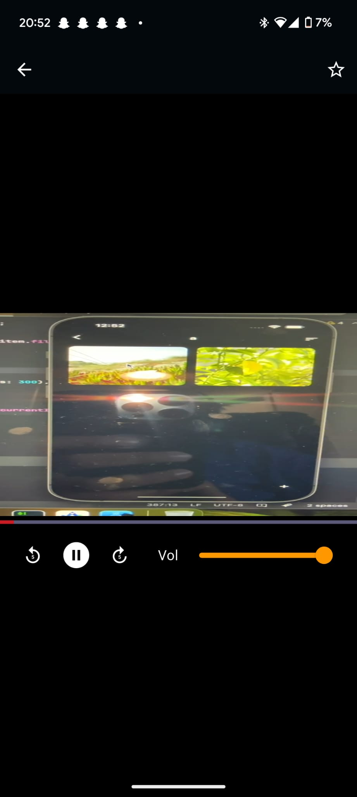

# Photo Organizer
A simple and efficient Flutter-based mobile application that helps users manage and organize their photos with ease. Whether you're trying to declutter your image library or just want to categorize your photos better, Photo Organizer provides a clean and intuitive experience.

## Features

- **Folder-Based Media Organization**: Organize your photos into folders for better management.
- **Search Functionality**: Quickly find photos using the built-in search feature.
- **Add and Delete Media**: Easily add new photos or delete unwanted ones.
- **Favourite Media Items**: Mark your favorite photos for quick access.
- **Dark Mode Toggle**: Switch between light and dark themes for a comfortable viewing experience.
- **Cross-Platform Support**: Works seamlessly on both Android and iOS devices.
- **Media Player in the App**: Play videos directly within the app.

## Screenshots

#### Home Screen


#### Search Functionality and Light/dark mode


#### Video player


#### Favourites


#### MetaData Preview


## Getting Started

### Prerequisites

Before you begin, ensure you have the following installed:

- **Flutter SDK**: [Install Flutter](https://flutter.dev/docs/get-started/install)
- **Android Studio** or **VS Code** with the Flutter plugin
- A connected device or emulator for testing

### Installation

1. Clone the repository:
   ```bash
   git clone https://github.com/your-repo/photo-organizer.git

2. Navigate to the project directory:
   ```bash 
   cd photo-organizer

3. Install dependencies:
   ```bash
   flutter pub get

4. Run the app:
   ```bash
   flutter run

## Project Structure

The project follows a modular structure for better maintainability:

```
lib/
├── models/
│   └── media_item.dart          # Data model for media files (File, folder, isFavorite)
├── pages/
│   ├── home_page.dart           # Main screen (folder grid view)
│   ├── folder_detail_page.dart  # Media grid inside a folder
│   └── detail_page.dart         # Full-screen media preview
├── widgets/
│   ├── category_chip.dart       # Custom UI for folder tags
│   └── image_grid_item.dart     # Reusable media grid item
├── main.dart                    # App entry point + theme setup
└── theme.dart                   # Light/dark theme configurations

test/                           # Unit/Widget tests (to be expanded)
pubspec.yaml                     # Dependencies and metadata
```

### Project Structure Diagram

